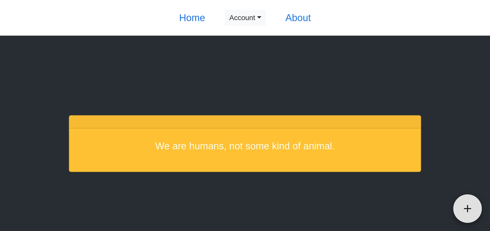

# Do you hear the people sing?

### Screenshot

### Usage
1. install `yarn` 
2. run `yarn`
3. run `./run.sh`

> After above operations, you can visit `http://localhost:3000` to see the result.

### Todo

1. find a way to transmit real time video or audio